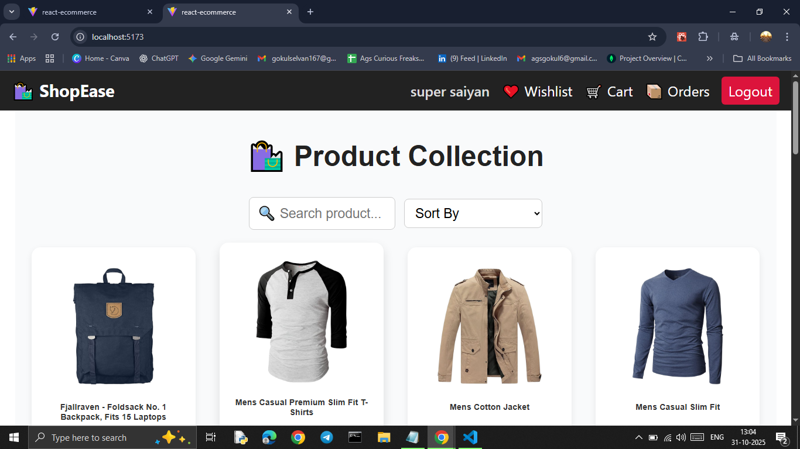
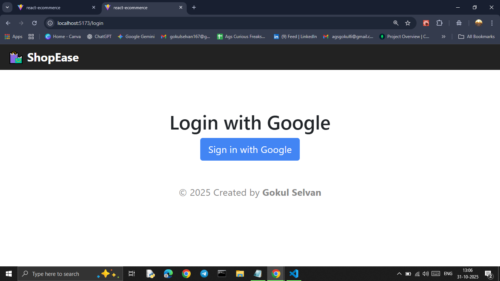
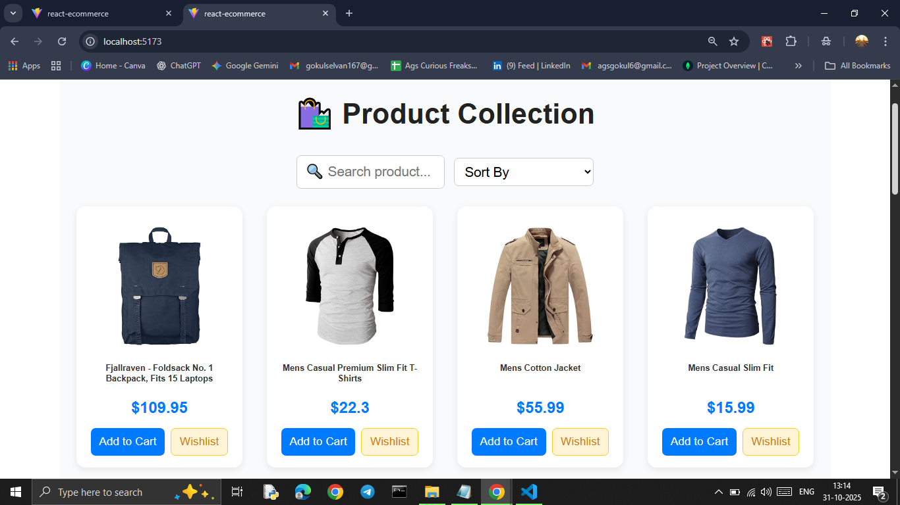
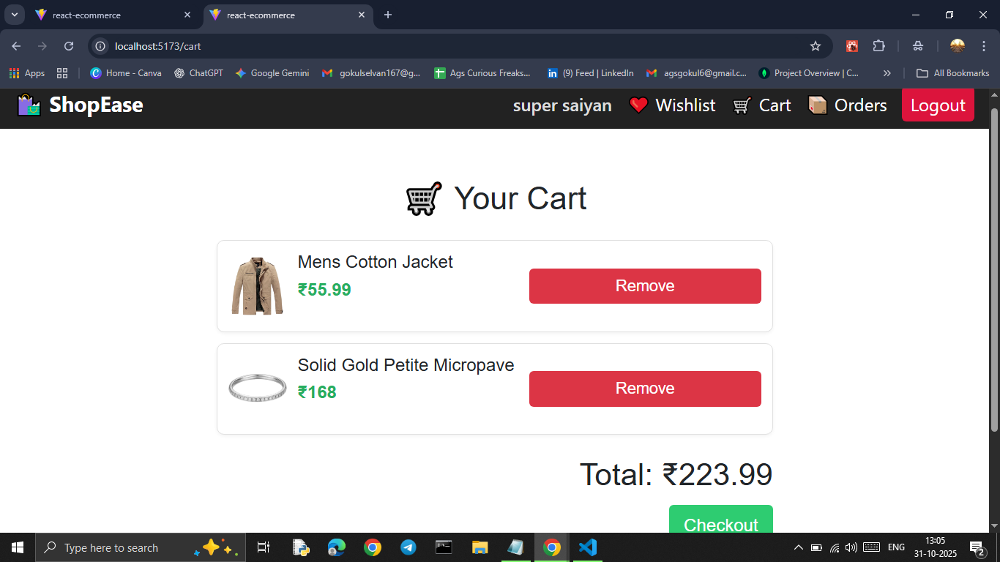
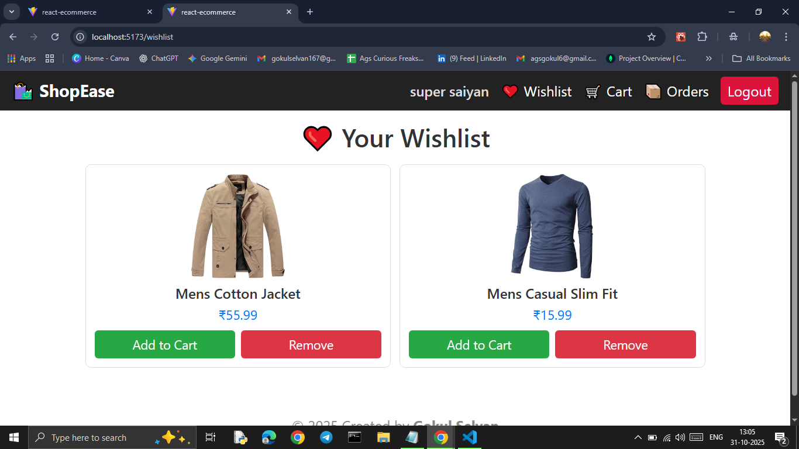
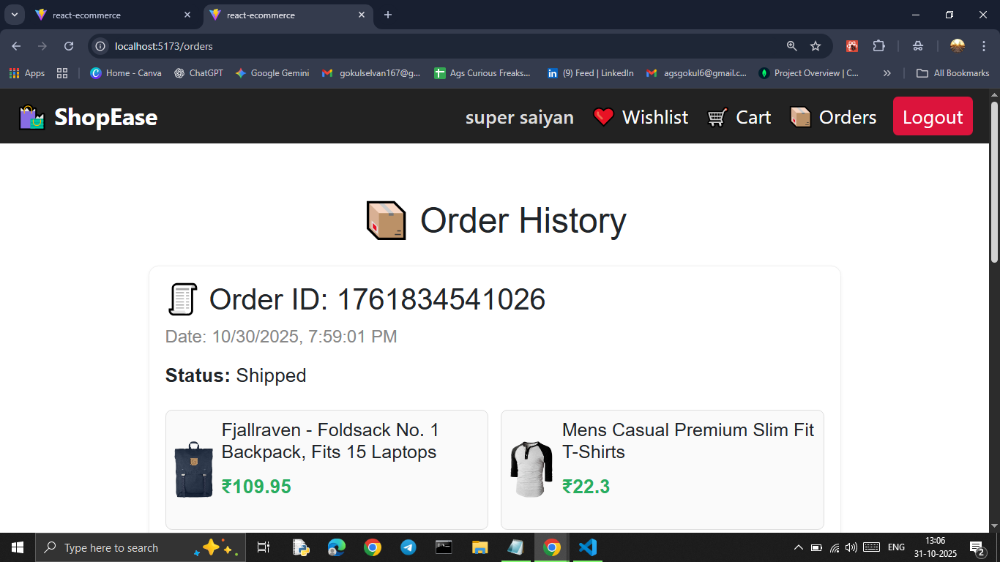
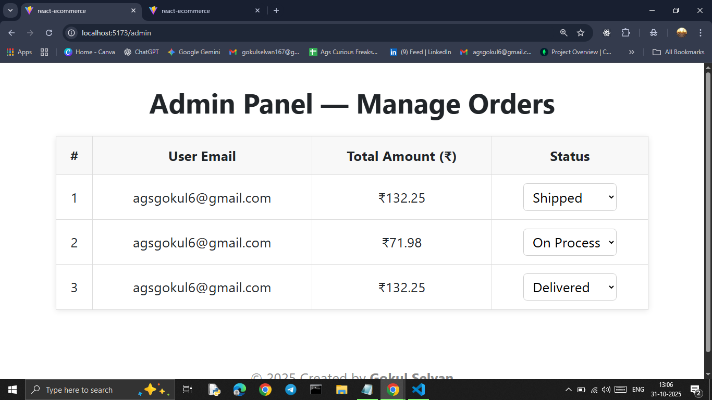

# 🛍️ React E-Commerce Simulation

A simple **React-based E-Commerce Simulation Project** 

---

## 🖼️ Project Screenshots

### 🏠 Homepage


### 🔐 Login Page


### 🛒 Product List


### 🧺 Cart Page


### ❤️ Wishlist


### 📦 My Orders


### 🧑‍💼 Admin Dashboard


---

## 🚀 Features

### 🛒 User Side
- View all products (fetched dynamically from FakeStore API)
- Add or remove items from the cart
- Wishlist system
- Checkout and place orders
- View all previous orders with status

### 🔑 Authentication
- Firebase Login / Logout
- Protected routes for authenticated users

### 🧑‍💼 Admin Simulation
- Separate `/admin` page (no navbar)
- View all placed orders
- Update order status (On Process → Shipped → Delivered)

---

## 🧠 Tech Stack
- **React.js**
- **FakeStore API**
- **Firebase Authentication**
- **LocalStorage** (for cart, wishlist, and orders)
- **CSS3**

---

## 🧾 Installation

```bash
# Clone this repo
git clone https://github.com/Gokul1234678/react-ecommerce-simulation.git

# Go inside the folder
cd react-ecommerce-simulation

# Install dependencies
npm install

# Start the app
npm run dev


### ✍️ Created By

**Gokul Selvan**  
💼 Full Stack Developer | MERN Stack Enthusiast  
🌐 Portfolio: https://gokul-selvan-dev.netlify.app/
📧 Email: gokul1672003@gmail.com